# ERP360 Data Flow Map
## Member Registration to Invoice & Debit Order Processing

---

## Visual Data Flow Diagram

```mermaid
flowchart TD
    Start([Member Walks In]) --> A[Staff Opens Members Page]
    A --> B[Click 'Add Member' Button]
    B --> C{Fill Member Form}
    
    C --> C1[Personal Info:<br/>First Name, Last Name<br/>Email, Phone, DOB]
    C --> C2[Address Info:<br/>Street Address<br/>City, Province, Zip]
    C --> C3[Banking Info:<br/>Account Number<br/>Bank Name, Branch]
    C --> C4[Emergency Contact:<br/>Name, Phone]
    C --> C5[Select Membership Type]
    C --> C6[Assign Sales Consultant]
    
    C1 --> D[Submit Form]
    C2 --> D
    C3 --> D
    C4 --> D
    C5 --> D
    C6 --> D
    
    D --> E{Backend Validation}
    E -->|Invalid| F[Return Error Message]
    F --> C
    E -->|Valid| G[Create Member Record]
    
    G --> G1[Generate Unique ID<br/>UUID]
    G --> G2[Generate QR Code<br/>Base64 Image]
    G --> G3[Geocode Address<br/>Get Lat/Long]
    G --> G4[Set Join Date<br/>Current DateTime]
    G --> G5[Calculate Expiry Date<br/>Join Date + Duration]
    G --> G6[Set Status: Active]
    
    G1 --> H[Save to MongoDB<br/>members Collection]
    G2 --> H
    G3 --> H
    G4 --> H
    G5 --> H
    G6 --> H
    
    H --> I[Trigger: member_joined]
    I --> I1[Check Active Automations]
    I1 -->|Found| I2[Execute Welcome Actions:<br/>SMS, Email, WhatsApp]
    I1 -->|None| J
    I2 --> J[Generate First Invoice]
    
    J --> J1[Create Invoice Record]
    J1 --> J2[Invoice Number:<br/>INV-MEMBERID-001]
    J2 --> J3[Amount: Membership Price]
    J3 --> J4[Due Date: Join Date + 7 days]
    J4 --> J5[Status: Pending]
    J5 --> J6[Payment Method: Debit Order]
    
    J6 --> K[Save to MongoDB<br/>invoices Collection]
    
    K --> L{Levy Enabled for<br/>Membership Type?}
    L -->|Yes| M[Schedule Member Levies]
    L -->|No| N
    
    M --> M1[Determine Levy Frequency:<br/>Annual/Bi-Annual]
    M --> M2[Determine Levy Timing:<br/>Anniversary/Fixed Date]
    M --> M3[Calculate Levy Amount:<br/>Fixed/Same as Membership/%]
    M --> M4[Calculate Next Levy Date]
    M --> M5[Create Levy Record]
    M5 --> N[Save to MongoDB<br/>levies Collection]
    
    N --> O{Sales Consultant<br/>Assigned?}
    O -->|Yes| P[Calculate Commission]
    O -->|No| Q
    
    P --> P1[Get Consultant Record]
    P --> P2[Get Commission Structure:<br/>% or Fixed Amount]
    P --> P3[Calculate Commission:<br/>Price × Rate]
    P --> P4[Create Commission Record]
    P4 --> R[Save to MongoDB<br/>commissions Collection]
    
    R --> Q[Member Creation Complete]
    Q --> S[Display Success Message]
    S --> T[Member Appears in List]
    
    T --> U([Wait for Invoice Due Date])
    
    U --> V{Invoice Processing<br/>Scheduled Job}
    
    V --> W[Check Due Invoices<br/>Daily Cron Job]
    W --> X{Invoices Due<br/>Today?}
    X -->|No| U
    X -->|Yes| Y[Process Debit Orders]
    
    Y --> Y1[Get Member Bank Details]
    Y --> Y2[Prepare Debit Order Request]
    Y --> Y3{Payment Gateway<br/>Integration}
    
    Y3 -->|Connected| Z[Submit to Bank API]
    Y3 -->|Mock| Z1[Simulate Payment]
    
    Z --> AA{Payment<br/>Successful?}
    Z1 --> AA
    
    AA -->|Success| AB[Update Invoice Status]
    AA -->|Failed| AC[Mark Invoice Failed]
    
    AB --> AB1[Status: Paid]
    AB --> AB2[Paid Date: Current DateTime]
    AB --> AB3[Payment Method: Debit Order]
    AB1 --> AD[Create Payment Record]
    AB2 --> AD
    AB3 --> AD
    
    AD --> AE[Save to MongoDB<br/>payments Collection]
    AE --> AF[Update Member Status]
    AF --> AF1[is_debtor: False]
    AF1 --> AG[Check for Other<br/>Unpaid Invoices]
    AG --> AH{All Invoices<br/>Paid?}
    AH -->|Yes| AI[Member in Good Standing]
    AH -->|No| AJ[Keep Debtor Flag]
    
    AI --> AK[Generate Next Invoice]
    AJ --> AK
    AK --> AK1{Recurring<br/>Membership?}
    AK1 -->|Yes| AL[Schedule Next Month Invoice]
    AK1 -->|No| AM[No Action]
    
    AL --> AN[Invoice Number:<br/>INV-MEMBERID-002]
    AN --> AO[Due Date: +1 Month]
    AO --> AP[Save to invoices]
    AP --> U
    AM --> END1([Payment Success Flow Complete])
    
    AC --> AC1[Status: Failed]
    AC --> AC2[Failure Reason:<br/>Insufficient Funds]
    AC --> AC3[Failure Date: Current DateTime]
    AC1 --> AQ[Update Member Status]
    AC2 --> AQ
    AC3 --> AQ
    
    AQ --> AQ1[is_debtor: True]
    AQ1 --> AR[Save to MongoDB]
    AR --> AS[Trigger: payment_failed]
    
    AS --> AT[Check Active Automations]
    AT -->|Found| AU[Execute Failure Actions]
    AU --> AU1[Send SMS Alert]
    AU --> AU2[Send Email Notification]
    AU --> AU3[Create Follow-up Task]
    AU --> AU4[Update Member Status<br/>if Conditions Met]
    
    AU1 --> AV[Log Execution History]
    AU2 --> AV
    AU3 --> AV
    AU4 --> AV
    
    AV --> AW[Save to automation_executions]
    AW --> AX[Notify Staff Dashboard]
    AX --> AY[Member in Debtor List]
    AY --> U
    
    AT -->|None| AZ[Manual Follow-up Required]
    AZ --> END2([Payment Failed Flow Complete])
    
    style Start fill:#90EE90
    style Q fill:#87CEEB
    style AI fill:#98FB98
    style END1 fill:#90EE90
    style END2 fill:#FFB6C1
    style AC fill:#FF6B6B
    style AB fill:#90EE90
```



---

## Detailed Data Flow Documentation

### Phase 1: Member Registration

#### Step 1: Data Collection (Frontend)
**Component:** Members.js → Create Member Form

**Input Data:**
```json
{
  "first_name": "John",
  "last_name": "Doe",
  "email": "john.doe@email.com",
  "phone": "+27123456789",
  "id_number": "8501015800086",
  "date_of_birth": "1985-01-01",
  "address": "123 Main Street, Cape Town, Western Cape, 8001",
  "emergency_contact_name": "Jane Doe",
  "emergency_contact_phone": "+27987654321",
  "bank_account_number": "1234567890",
  "bank_name": "Standard Bank",
  "bank_branch_code": "051001",
  "membership_type_id": "uuid-membership-type-123",
  "sales_consultant_id": "uuid-consultant-456"
}
```

**Action:** Form validation on client-side
**Next:** POST request to `/api/members`

---

#### Step 2: Backend Processing (server.py)
**Component:** `create_member()` endpoint

**Process Flow:**
1. **Receive Request Data**
2. **Validate Membership Type Exists**
   - Query: `db.membership_types.find_one({"id": membership_type_id})`
   - If not found: Return 404 error
3. **Create Member Object** with Pydantic model validation
4. **Generate Unique Member ID** - `uuid.uuid4()`
5. **Calculate Expiry Date** - `join_date + (duration_months × 30 days)`
6. **Generate QR Code**
   ```python
   qr_data = f"MEMBER:{member.id}:{member.email}"
   qr_code = generate_qr_code(qr_data)  # Returns base64 image
   ```
7. **Geocode Address** (if provided)
   ```python
   lat, lon = geocode_address(member.address)
   member.latitude = lat
   member.longitude = lon
   ```
8. **Set Consultant Name** (if consultant assigned)
   - Query: `db.consultants.find_one({"id": sales_consultant_id})`
   - Set: `member.sales_consultant_name = full_name`

**Database Write #1:**
```javascript
db.members.insert_one({
  "id": "uuid-member-789",
  "first_name": "John",
  "last_name": "Doe",
  "email": "john.doe@email.com",
  "phone": "+27123456789",
  "id_number": "8501015800086",
  "date_of_birth": "1985-01-01",
  "address": "123 Main Street, Cape Town, Western Cape, 8001",
  "latitude": -33.9249,
  "longitude": 18.4241,
  "emergency_contact_name": "Jane Doe",
  "emergency_contact_phone": "+27987654321",
  "bank_account_number": "1234567890",
  "bank_name": "Standard Bank",
  "bank_branch_code": "051001",
  "membership_type_id": "uuid-membership-type-123",
  "membership_status": "active",
  "join_date": "2025-10-15T10:30:00Z",
  "expiry_date": "2026-10-15T10:30:00Z",
  "qr_code": "data:image/png;base64,iVBORw0KGgoAAAANSUhEUg...",
  "sales_consultant_id": "uuid-consultant-456",
  "sales_consultant_name": "Sarah Smith",
  "is_debtor": false
})
```

---

#### Step 3: Automation Trigger - member_joined
**Component:** `trigger_automation()` function

**Process:**
1. **Find Active Automations**
   ```javascript
   db.automations.find({
     "trigger_type": "member_joined",
     "enabled": true
   })
   ```

2. **Prepare Trigger Data**
   ```json
   {
     "member_id": "uuid-member-789",
     "member_name": "John Doe",
     "email": "john.doe@email.com",
     "phone": "+27123456789",
     "membership_type": "Premium Monthly",
     "join_date": "2025-10-15T10:30:00Z"
   }
   ```

3. **For Each Automation:**
   - Check conditions (if any)
   - Execute actions sequentially
   - Log execution

4. **Example Actions Executed:**
   - **Action 1:** Send SMS (delay: 0 min)
     ```
     Message: "Welcome John Doe! Thank you for joining our gym."
     Status: sent_mock (or actual if SMS service integrated)
     ```
   - **Action 2:** Send Email (delay: 5 min)
     ```
     Subject: "Welcome to Our Gym!"
     Body: "Dear John, here's your getting started guide..."
     Status: sent_mock
     ```

**Database Write #2:**
```javascript
db.automation_executions.insert_one({
  "id": "uuid-execution-001",
  "automation_id": "uuid-automation-welcome",
  "automation_name": "Welcome New Member",
  "trigger_data": {...},
  "scheduled_for": "2025-10-15T10:30:00Z",
  "executed_at": "2025-10-15T10:30:05Z",
  "status": "completed",
  "result": {
    "executed": true,
    "actions_executed": 2,
    "results": [...]
  },
  "created_at": "2025-10-15T10:30:00Z"
})
```

---

### Phase 2: Invoice Generation

#### Step 4: Create First Invoice
**Component:** Still in `create_member()` endpoint

**Process:**
1. **Get Membership Price** from membership_type record
2. **Generate Invoice Number** - `INV-{first_8_chars_of_member_id}-001`
3. **Calculate Due Date** - `current_date + 7 days`
4. **Create Invoice Object**

**Database Write #3:**
```javascript
db.invoices.insert_one({
  "id": "uuid-invoice-001",
  "invoice_number": "INV-uuid-mem-001",
  "member_id": "uuid-member-789",
  "amount": 500.00,
  "description": "Membership: Premium Monthly",
  "due_date": "2025-10-22T10:30:00Z",
  "status": "pending",
  "payment_method": null,
  "paid_date": null,
  "created_at": "2025-10-15T10:30:00Z"
})
```

---

#### Step 5: Schedule Levies (if enabled)
**Component:** `schedule_member_levies()` function

**Conditions Check:**
- `membership_type.levy_enabled == true`

**Process if True:**
1. **Get Levy Configuration**
   ```json
   {
     "levy_frequency": "annual",
     "levy_timing": "anniversary",
     "levy_amount_type": "fixed",
     "levy_amount": 150.00
   }
   ```

2. **Calculate Next Levy Date**
   - If anniversary: `join_date + 1 year`
   - If fixed: Next occurrence of fixed date

3. **Calculate Levy Amount**
   - If fixed: Use configured amount
   - If same_as_membership: Use membership price
   - If percentage: Calculate percentage of membership

**Database Write #4:**
```javascript
db.levies.insert_one({
  "id": "uuid-levy-001",
  "member_id": "uuid-member-789",
  "membership_type_id": "uuid-membership-type-123",
  "levy_type": "annual",
  "amount": 150.00,
  "next_levy_date": "2026-10-15T10:30:00Z",
  "status": "scheduled",
  "payment_type": "debit_order",
  "created_at": "2025-10-15T10:30:00Z"
})
```

---

#### Step 6: Calculate Commission
**Component:** `calculate_commission()` function

**Conditions Check:**
- `member.sales_consultant_id != null`

**Process:**
1. **Get Consultant Details**
   ```javascript
   db.consultants.find_one({"id": "uuid-consultant-456"})
   ```

2. **Get Commission Structure**
   ```javascript
   db.commissions.find_one({
     "consultant_id": "uuid-consultant-456",
     "membership_type_id": "uuid-membership-type-123"
   })
   ```
   Or use default: 10%

3. **Calculate Amount**
   ```
   commission_amount = membership_price × commission_rate
   commission_amount = 500.00 × 0.10 = 50.00
   ```

**Database Write #5:**
```javascript
db.commissions.insert_one({
  "id": "uuid-commission-001",
  "consultant_id": "uuid-consultant-456",
  "consultant_name": "Sarah Smith",
  "member_id": "uuid-member-789",
  "member_name": "John Doe",
  "membership_type": "Premium Monthly",
  "sale_amount": 500.00,
  "commission_rate": 0.10,
  "commission_amount": 50.00,
  "sale_date": "2025-10-15T10:30:00Z",
  "payment_status": "pending",
  "payment_date": null
})
```

---

### Phase 3: Debit Order Processing

#### Step 7: Scheduled Job Checks Due Invoices
**Component:** Background Job (Cron/Scheduler)

**Schedule:** Runs daily at 6:00 AM

**Process:**
1. **Query Due Invoices**
   ```javascript
   db.invoices.find({
     "status": "pending",
     "due_date": { 
       "$lte": new Date().toISOString() 
     }
   })
   ```

2. **For Each Invoice:**
   - Get member details (bank info)
   - Process payment

---

#### Step 8: Process Debit Order Payment with DoBilling API
**Component:** Payment processing function with DoBilling API integration

**DoBilling API Configuration:**
- **Host:** `api.beta.dobilling.com`
- **Protocol:** HTTPS
- **Authentication:** Basic HTTP Authentication
- **API Version:** V2
- **Data Format:** JSON

**Process Flow:**

**A. Get Member Banking Details**
```javascript
member = db.members.find_one({"id": invoice.member_id})
bank_details = {
  "account_number": member.bank_account_number,
  "bank_name": member.bank_name,
  "branch_code": member.bank_branch_code,
  "account_holder_name": `${member.first_name} ${member.last_name}`,
  "email": member.email,
  "phone": member.phone
}
```

**B. Check/Create Payment Method in DoBilling**

**API Call 1: Check if Payment Method Exists**
```http
GET https://api.beta.dobilling.com/v2/paymentmethods
Authorization: Basic {base64_encoded_credentials}
Content-Type: application/json
```

**Response:**
```json
{
  "data": [
    {
      "Token": "pm_token_123",
      "Type": "BankAccount",
      "BankAccount": {
        "AccountNumber": "1234567890",
        "BranchCode": "051001",
        "DebitMethod": "debit_order",
        "DebitMethodType": "NAEDO"
      }
    }
  ]
}
```

**If Payment Method Doesn't Exist, Create It:**

**API Call 2: Add Bank Account Payment Method**
```http
POST https://api.beta.dobilling.com/v2/paymentmethods/bankaccount
Authorization: Basic {base64_encoded_credentials}
Content-Type: application/json

{
  "FirstName": "John",
  "LastName": "Doe",
  "Email": "john.doe@email.com",
  "MobileNumber": "+27123456789",
  "AccountNumber": "1234567890",
  "AccountHolder": "John Doe",
  "BranchCode": "051001",
  "BankName": "Standard Bank",
  "AccountType": "Current",
  "DebitMethod": "debit_order",
  "DebitMethodType": "NAEDO"
}
```

**Response:**
```json
{
  "Token": "pm_token_456",
  "isSuccess": true,
  "ErrorMessage": null
}
```

**Store Payment Method Token:**
```javascript
db.members.update_one(
  {"id": "uuid-member-789"},
  {"$set": {"payment_method_token": "pm_token_456"}}
)
```

**C. Create or Get Today's Batch**

**API Call 3: List Batches**
```http
GET https://api.beta.dobilling.com/v2/batches
Authorization: Basic {base64_encoded_credentials}
```

**Response:**
```json
{
  "data": [
    {
      "BatchToken": "batch_token_2025_10_22",
      "batchID": 12345,
      "Description": "Daily Debit Orders - 2025-10-22",
      "CreatedDate": "2025-10-22T00:00:00Z",
      "TotalLines": 45,
      "TotalAmount": 22500.00
    }
  ]
}
```

**If No Batch for Today, Create New Batch:**
```javascript
// Note: Batch creation might be handled through a separate process
// or automatically when first line is added. Check DoBilling docs.
current_batch_token = "batch_token_2025_10_22"
```

**D. Add Invoice to Batch**

**API Call 4: Append Batch Line**
```http
POST https://api.beta.dobilling.com/v2/batches/{BatchToken}/lines
Authorization: Basic {base64_encoded_credentials}
Content-Type: application/json

{
  "ExtRef": "uuid-invoice-001",
  "Amount": 500.00,
  "Ref": "INV-uuid-mem-001",
  "Memo": "Gym Membership Fee - Premium Monthly",
  "PaymentMethodToken": "pm_token_456",
  "Email": "john.doe@email.com",
  "MobileNumber": "+27123456789"
}
```

**Response:**
```json
{
  "batchLineID": 789,
  "BatchToken": "batch_token_2025_10_22",
  "batchID": 12345,
  "ExtRef": "uuid-invoice-001",
  "Amount": 500.00,
  "Ref": "INV-uuid-mem-001",
  "Memo": "Gym Membership Fee - Premium Monthly",
  "PaymentMethodToken": "pm_token_456",
  "isSuccess": true,
  "ErrorMessage": null
}
```

**Store Batch Line Reference:**
```javascript
db.invoices.update_one(
  {"id": "uuid-invoice-001"},
  {"$set": {
    "batch_token": "batch_token_2025_10_22",
    "batch_line_id": 789,
    "processing_status": "queued"
  }}
)
```

**E. Batch Processing (Scheduled)**

**Note:** Batch processing is typically triggered:
- Automatically at end of day (e.g., 11:59 PM)
- Manually via DoBilling dashboard
- Via API call (if submit endpoint exists)

**During Processing:**
1. DoBilling submits all batch lines to respective banks
2. Each line is processed individually
3. Results are updated in batch line records

**F. Check Batch Line Status (Next Day)**

**API Call 5: Get Batch Line Status**
```http
GET https://api.beta.dobilling.com/v2/batches/line?batchLineID=789
Authorization: Basic {base64_encoded_credentials}
```

**Response (Success):**
```json
{
  "batchLineID": 789,
  "BatchToken": "batch_token_2025_10_22",
  "batchID": 12345,
  "ExtRef": "uuid-invoice-001",
  "Amount": 500.00,
  "Ref": "INV-uuid-mem-001",
  "PaymentMethodToken": "pm_token_456",
  "isSuccess": true,
  "ErrorMessage": null,
  "ProcessedDate": "2025-10-23T02:30:00Z",
  "TransactionID": "TXN_BANK_123456"
}
```

**Response (Failure):**
```json
{
  "batchLineID": 789,
  "BatchToken": "batch_token_2025_10_22",
  "batchID": 12345,
  "ExtRef": "uuid-invoice-001",
  "Amount": 500.00,
  "Ref": "INV-uuid-mem-001",
  "PaymentMethodToken": "pm_token_456",
  "isSuccess": false,
  "ErrorMessage": "Insufficient funds in account",
  "ProcessedDate": "2025-10-23T02:30:00Z"
}
```

**G. Update Internal Records Based on Status**

This leads to either Step 9A (Success) or Step 9B (Failure) below.

---

#### Step 9A: Payment Successful Path

**Response from Bank:**
```json
{
  "status": "success",
  "transaction_id": "TXN123456789",
  "amount": 500.00,
  "timestamp": "2025-10-22T06:15:00Z"
}
```

**Process:**

1. **Update Invoice**
   ```javascript
   db.invoices.update_one(
     {"id": "uuid-invoice-001"},
     {
       "$set": {
         "status": "paid",
         "paid_date": "2025-10-22T06:15:00Z",
         "payment_method": "debit_order"
       }
     }
   )
   ```

2. **Create Payment Record** (Database Write #6)
   ```javascript
   db.payments.insert_one({
     "id": "uuid-payment-001",
     "invoice_id": "uuid-invoice-001",
     "member_id": "uuid-member-789",
     "amount": 500.00,
     "payment_method": "debit_order",
     "payment_date": "2025-10-22T06:15:00Z",
     "transaction_id": "TXN123456789",
     "status": "completed"
   })
   ```

3. **Check Member's Other Invoices**
   ```javascript
   unpaid_count = db.invoices.count_documents({
     "member_id": "uuid-member-789",
     "status": {"$in": ["pending", "overdue", "failed"]}
   })
   ```

4. **Update Member Debtor Status**
   ```javascript
   if (unpaid_count == 0) {
     db.members.update_one(
       {"id": "uuid-member-789"},
       {"$set": {"is_debtor": false}}
     )
   }
   ```

5. **Generate Next Invoice** (for recurring memberships)
   ```javascript
   db.invoices.insert_one({
     "id": "uuid-invoice-002",
     "invoice_number": "INV-uuid-mem-002",
     "member_id": "uuid-member-789",
     "amount": 500.00,
     "description": "Membership: Premium Monthly",
     "due_date": "2025-11-22T06:15:00Z",
     "status": "pending",
     "created_at": "2025-10-22T06:15:00Z"
   })
   ```

**Dashboard Updates:**
- Total revenue increases
- Member remains in "Active" list
- Payment appears in recent transactions
- Invoice marked as paid in member's invoice list

---

#### Step 9B: Payment Failed Path

**Response from Bank:**
```json
{
  "status": "failed",
  "error_code": "INSUFFICIENT_FUNDS",
  "message": "Insufficient funds in account",
  "timestamp": "2025-10-22T06:15:00Z"
}
```

**Process:**

1. **Update Invoice** (Database Write #7)
   ```javascript
   db.invoices.update_one(
     {"id": "uuid-invoice-001"},
     {
       "$set": {
         "status": "failed",
         "failure_reason": "Insufficient funds in account",
         "failure_date": "2025-10-22T06:15:00Z"
       }
     }
   )
   ```

2. **Update Member Debtor Status**
   ```javascript
   db.members.update_one(
     {"id": "uuid-member-789"},
     {"$set": {"is_debtor": true}}
   )
   ```

3. **Trigger Automation: payment_failed**
   
   **Prepare Trigger Data:**
   ```json
   {
     "member_id": "uuid-member-789",
     "member_name": "John Doe",
     "email": "john.doe@email.com",
     "phone": "+27123456789",
     "invoice_id": "uuid-invoice-001",
     "invoice_number": "INV-uuid-mem-001",
     "amount": 500.00,
     "failure_reason": "Insufficient funds in account"
   }
   ```

4. **Find Active Automations**
   ```javascript
   automations = db.automations.find({
     "trigger_type": "payment_failed",
     "enabled": true
   })
   ```

5. **Example: High Value Invoice Automation**
   ```json
   {
     "name": "Payment Failed Alert",
     "trigger_type": "payment_failed",
     "conditions": {
       "amount": {"operator": ">=", "value": 400}
     },
     "actions": [
       {
         "type": "send_sms",
         "delay_minutes": 0,
         "message": "Hi {member_name}, your payment of R{amount} failed. Please update your details."
       },
       {
         "type": "send_email",
         "delay_minutes": 5,
         "subject": "Payment Failed - Action Required",
         "body": "Dear {member_name}, your debit order payment failed..."
       },
       {
         "type": "create_task",
         "delay_minutes": 10,
         "task_title": "Follow up on failed payment",
         "task_description": "Contact {member_name} about failed payment of R{amount}",
         "assigned_to": "admin@gym.com"
       }
     ]
   }
   ```

6. **Check Conditions**
   ```
   Condition: amount >= 400
   Trigger Data: amount = 500.00
   Result: TRUE ✓
   ```

7. **Execute Actions**
   
   **Action 1 - Send SMS (immediate):**
   ```javascript
   execute_action({
     "type": "send_sms",
     "phone": "+27123456789",
     "message": "Hi John Doe, your payment of R500.00 failed. Please update your details."
   })
   // Result: sent_mock
   ```
   
   **Action 2 - Send Email (5 min delay):**
   ```javascript
   schedule_action_execution({
     "type": "send_email",
     "scheduled_for": "2025-10-22T06:20:00Z",
     "email": "john.doe@email.com",
     "subject": "Payment Failed - Action Required",
     "body": "Dear John Doe, your debit order payment failed..."
   })
   ```
   
   **Action 3 - Create Task (10 min delay):**
   ```javascript
   schedule_action_execution({
     "type": "create_task",
     "scheduled_for": "2025-10-22T06:25:00Z",
     "task_title": "Follow up on failed payment",
     "task_description": "Contact John Doe about failed payment of R500.00",
     "assigned_to": "admin@gym.com"
   })
   ```

8. **Log Execution** (Database Write #8)
   ```javascript
   db.automation_executions.insert_one({
     "id": "uuid-execution-002",
     "automation_id": "uuid-automation-payment-failed",
     "automation_name": "Payment Failed Alert",
     "trigger_data": {...},
     "scheduled_for": "2025-10-22T06:15:00Z",
     "executed_at": "2025-10-22T06:15:05Z",
     "status": "completed",
     "result": {
       "executed": true,
       "actions_executed": 3,
       "results": [
         {"action_type": "send_sms", "status": "completed"},
         {"action_type": "send_email", "status": "scheduled"},
         {"action_type": "create_task", "status": "scheduled"}
       ]
     },
     "created_at": "2025-10-22T06:15:00Z"
   })
   ```

9. **Update Automation Stats**
   ```javascript
   db.automations.update_one(
     {"id": "uuid-automation-payment-failed"},
     {
       "$set": {"last_triggered": "2025-10-22T06:15:00Z"},
       "$inc": {"execution_count": 1}
     }
   )
   ```

**Dashboard Updates:**
- Member appears in "Debtors" list
- Failed invoice appears in "Outstanding Invoices"
- Notification appears for staff to follow up
- Task created in staff task list
- Automation execution logged in history

---

## DoBilling API Integration Details

### Batch Processing Workflow

#### Daily Batch Cycle

**Morning (6:00 AM) - Batch Status Check:**
```javascript
// Scheduled job checks previous day's batch results
async function checkBatchResults() {
  // Get yesterday's batch token
  const yesterday = new Date();
  yesterday.setDate(yesterday.getDate() - 1);
  const batchToken = `batch_token_${yesterday.toISOString().split('T')[0]}`;
  
  // API Call: Get all batch lines
  const response = await fetch(
    `https://api.beta.dobilling.com/v2/batches/lines?BatchToken=${batchToken}`,
    {
      method: 'GET',
      headers: {
        'Authorization': `Basic ${base64Credentials}`,
        'Content-Type': 'application/json'
      }
    }
  );
  
  const batchLines = await response.json();
  
  // Process each batch line result
  for (const line of batchLines.data) {
    await processLineResult(line);
  }
}
```

**Process Line Results:**
```javascript
async function processLineResult(batchLine) {
  const invoice = await db.invoices.find_one({
    "batch_line_id": batchLine.batchLineID
  });
  
  if (!invoice) return;
  
  if (batchLine.isSuccess) {
    // Success Path - Update invoice as paid
    await updateInvoicePaid(invoice.id, batchLine.TransactionID);
  } else {
    // Failure Path - Mark as failed and trigger automation
    await updateInvoiceFailed(
      invoice.id, 
      batchLine.ErrorMessage
    );
  }
}
```

**Throughout Day (6:00 AM - 11:00 PM) - Queue Payments:**
```javascript
// When invoice becomes due or manual payment needed
async function queuePaymentForBatch(invoice, member) {
  // Get or create today's batch token
  const today = new Date().toISOString().split('T')[0];
  const batchToken = `batch_token_${today}`;
  
  // Get or create payment method token
  let paymentMethodToken = member.payment_method_token;
  
  if (!paymentMethodToken) {
    paymentMethodToken = await createPaymentMethod(member);
  }
  
  // Add to batch
  const batchLine = await addToBatch(
    batchToken,
    invoice,
    paymentMethodToken,
    member
  );
  
  // Store batch reference
  await db.invoices.update_one(
    {"id": invoice.id},
    {"$set": {
      "batch_token": batchToken,
      "batch_line_id": batchLine.batchLineID,
      "processing_status": "queued"
    }}
  );
}
```

**End of Day (11:00 PM) - Batch Submission:**
```javascript
// Batch is automatically processed by DoBilling
// No manual submission needed if using automatic processing
// OR manually trigger via DoBilling dashboard
// Results available next morning
```

---

### DoBilling API Endpoints Used

#### 1. Payment Method Management

**List Payment Methods:**
```http
GET https://api.beta.dobilling.com/v2/paymentmethods
Authorization: Basic {credentials}
```

**Add Bank Account:**
```http
POST https://api.beta.dobilling.com/v2/paymentmethods/bankaccount
Authorization: Basic {credentials}
Content-Type: application/json

Body: {
  "FirstName": string,
  "LastName": string,
  "Email": string,
  "MobileNumber": string,
  "AccountNumber": string,
  "AccountHolder": string,
  "BranchCode": string,
  "BankName": string,
  "AccountType": "Current" | "Savings",
  "DebitMethod": "debit_order",
  "DebitMethodType": "NAEDO"
}

Response: {
  "Token": string,
  "isSuccess": boolean,
  "ErrorMessage": string | null
}
```

**Get Payment Method:**
```http
GET https://api.beta.dobilling.com/v2/paymentmethods/{token}
Authorization: Basic {credentials}
```

**Delete Payment Method:**
```http
DELETE https://api.beta.dobilling.com/v2/paymentmethods/{token}
Authorization: Basic {credentials}
```

#### 2. Batch Management

**List All Batches:**
```http
GET https://api.beta.dobilling.com/v2/batches
Authorization: Basic {credentials}

Response: {
  "data": [
    {
      "BatchToken": string,
      "batchID": integer,
      "Description": string,
      "CreatedDate": datetime,
      "TotalLines": integer,
      "TotalAmount": number
    }
  ]
}
```

**Get Specific Batch:**
```http
GET https://api.beta.dobilling.com/v2/batches/get?BatchToken={token}
Authorization: Basic {credentials}
```

**List Batch Lines:**
```http
GET https://api.beta.dobilling.com/v2/batches/lines?BatchToken={token}&page={page}&page_size={size}
Authorization: Basic {credentials}

Response: {
  "data": [
    {
      "batchLineID": integer,
      "BatchToken": string,
      "batchID": integer,
      "ExtRef": string,
      "Amount": number,
      "Ref": string,
      "Memo": string,
      "PaymentMethodToken": string,
      "isSuccess": boolean,
      "ErrorMessage": string | null,
      "ProcessedDate": datetime,
      "TransactionID": string
    }
  ],
  "pagination": {
    "page": integer,
    "page_size": integer,
    "total": integer
  }
}
```

**Get Single Batch Line:**
```http
GET https://api.beta.dobilling.com/v2/batches/line?batchLineID={id}
Authorization: Basic {credentials}
```

**Add Line to Batch:**
```http
POST https://api.beta.dobilling.com/v2/batches/{BatchToken}/lines
Authorization: Basic {credentials}
Content-Type: application/json

Body: {
  "ExtRef": string,           // Your invoice ID
  "Amount": number,            // Amount to debit
  "Ref": string,              // Invoice number
  "Memo": string,             // Description
  "PaymentMethodToken": string,
  "Email": string,
  "MobileNumber": string
}

Response: {
  "batchLineID": integer,
  "BatchToken": string,
  "batchID": integer,
  "ExtRef": string,
  "Amount": number,
  "Ref": string,
  "Memo": string,
  "PaymentMethodToken": string,
  "isSuccess": boolean,
  "ErrorMessage": string | null
}
```

#### 3. DebiCheck Mandate Management (Optional - for DebiCheck)

**Initiate DebiCheck Mandate:**
```http
POST https://api.beta.dobilling.com/v2/paymentmethods/debicheck
Authorization: Basic {credentials}
Content-Type: application/json

Body: {
  "PaymentMethodToken": string,
  "ContractReference": string,
  "MaximumCollectionAmount": number,
  "InstalmentAmount": number,
  "InstalmentOccurence": integer,
  "Frequency": "Monthly" | "Weekly" | "Quarterly",
  "DebtorName": string,
  "DebtorIDNumber": string,
  "DebtorEmail": string,
  "DebtorMobile": string
}

Response: {
  "MandateToken": string,
  "isSuccess": boolean,
  "ErrorMessage": string | null
}
```

**Amend DebiCheck Mandate:**
```http
PUT https://api.beta.dobilling.com/v2/paymentmethods/debicheck
Authorization: Basic {credentials}
Content-Type: application/json

Body: {
  "MandateToken": string,
  "MaximumCollectionAmount": number,
  "InstalmentAmount": number,
  // ... other fields to amend
}
```

**Cancel DebiCheck Mandate:**
```http
DELETE https://api.beta.dobilling.com/v2/paymentmethods/debicheck/{token}
Authorization: Basic {credentials}
```

---

### Error Handling and Retry Logic

**Common Error Codes and Responses:**

```javascript
const ERROR_HANDLERS = {
  "Insufficient funds in account": {
    action: "trigger_automation",
    retry: false,
    notification: "immediate"
  },
  "Account closed": {
    action: "suspend_member",
    retry: false,
    notification: "immediate"
  },
  "Invalid account details": {
    action: "request_update",
    retry: false,
    notification: "immediate"
  },
  "Account blocked": {
    action: "manual_review",
    retry: true,
    retry_delay: 7, // days
    notification: "delayed"
  },
  "Bank system unavailable": {
    action: "retry",
    retry: true,
    retry_delay: 1, // days
    notification: "none"
  },
  "Transaction limit exceeded": {
    action: "split_payment",
    retry: true,
    notification: "staff"
  }
};
```

**Retry Logic:**
```javascript
async function handleFailedPayment(invoice, errorMessage) {
  const errorConfig = ERROR_HANDLERS[errorMessage] || {
    action: "manual_review",
    retry: false,
    notification: "immediate"
  };
  
  if (errorConfig.retry) {
    // Schedule retry
    const retryDate = new Date();
    retryDate.setDate(retryDate.getDate() + errorConfig.retry_delay);
    
    await db.invoices.update_one(
      {"id": invoice.id},
      {"$set": {
        "retry_scheduled": retryDate.toISOString(),
        "retry_count": (invoice.retry_count || 0) + 1
      }}
    );
  }
  
  // Trigger appropriate automation
  if (errorConfig.notification === "immediate") {
    await trigger_automation("payment_failed", {
      member_id: invoice.member_id,
      invoice_id: invoice.id,
      amount: invoice.amount,
      failure_reason: errorMessage
    });
  }
}
```

---

### Database Schema Updates for DoBilling Integration

**Additional Fields for Members Collection:**
```javascript
{
  "payment_method_token": "pm_token_456",  // DoBilling payment method token
  "mandate_token": "mandate_token_789",     // For DebiCheck (optional)
  "mandate_status": "active",               // active, pending, suspended, cancelled
  "last_payment_sync": "2025-10-22T06:15:00Z"
}
```

**Additional Fields for Invoices Collection:**
```javascript
{
  "batch_token": "batch_token_2025_10_22",
  "batch_line_id": 789,
  "processing_status": "queued",  // queued, processing, completed, failed
  "transaction_id": "TXN_BANK_123456",  // From successful payment
  "retry_count": 0,
  "retry_scheduled": null,
  "last_sync_attempt": "2025-10-23T06:00:00Z"
}
```

**New Collection: Payment Sync Log:**
```javascript
db.payment_sync_logs.insert_one({
  "id": "uuid-sync-log-001",
  "sync_type": "batch_check",
  "batch_token": "batch_token_2025_10_22",
  "sync_date": "2025-10-23T06:00:00Z",
  "lines_checked": 45,
  "lines_success": 38,
  "lines_failed": 7,
  "total_amount_success": 19000.00,
  "total_amount_failed": 3500.00,
  "sync_duration_ms": 2345,
  "errors": [
    {
      "batch_line_id": 789,
      "invoice_id": "uuid-invoice-001",
      "error_message": "Insufficient funds in account"
    }
  ]
})
```

---

## Data Entities Summary

### Collections Involved:

1. **members** - Member records
2. **membership_types** - Available membership plans
3. **invoices** - All invoices generated
4. **payments** - Payment records
5. **levies** - Levy schedules
6. **consultants** - Sales consultant profiles
7. **commissions** - Commission records
8. **automations** - Automation rules
9. **automation_executions** - Execution logs
10. **tasks** - Staff follow-up tasks

---

## Key Data Relationships

```
Member
  ├── has many: Invoices
  ├── has many: Payments
  ├── has many: Levies
  ├── belongs to: Membership Type
  ├── assigned to: Sales Consultant
  └── triggers: Automations

Invoice
  ├── belongs to: Member
  ├── has one: Payment (when paid)
  └── triggers: Automations (payment_failed, invoice_overdue)

Payment
  ├── belongs to: Invoice
  └── belongs to: Member

Levy
  ├── belongs to: Member
  └── belongs to: Membership Type

Commission
  ├── belongs to: Consultant
  ├── relates to: Member
  └── relates to: Membership Type

Automation
  ├── triggered by: Events
  ├── has many: Automation Executions
  └── creates: Tasks, Messages, Updates

Automation Execution
  ├── belongs to: Automation
  └── contains: Trigger Data, Results
```

---

## Data Flow Timeline with DoBilling Integration

```
DAY 1 - MEMBER REGISTRATION:
T+0 min:    Member Registration Form Submitted
T+0.5 sec:  Member Record Created in DB
T+0.5 sec:  QR Code Generated
T+0.6 sec:  Address Geocoded
T+1 sec:    First Invoice Created
T+1 sec:    Levy Scheduled (if applicable)
T+1.1 sec:  Commission Calculated
T+1.2 sec:  member_joined Automation Triggered
T+1.3 sec:  Welcome SMS Sent
T+6 min:    Welcome Email Sent (5 min delay)

T+5 sec:    Check Payment Method in DoBilling
T+6 sec:    Create Payment Method (if not exists)
            API Call: POST /v2/paymentmethods/bankaccount
            Response: Payment Method Token stored

DAY 8 - INVOICE DUE, BATCH QUEUEING:
T+7d+6am:   Daily Job: Check Due Invoices
T+7d+6am+1s: Get Today's Batch Token (batch_token_2025_10_22)
T+7d+6am+2s: For Each Due Invoice:
T+7d+6am+3s:   - Get Payment Method Token
T+7d+6am+4s:   - API Call: POST /v2/batches/{BatchToken}/lines
T+7d+6am+5s:   - Response: Batch Line Created (batchLineID: 789)
T+7d+6am+6s:   - Update Invoice with batch_token and batch_line_id
T+7d+6am+7s:   - Mark invoice processing_status: "queued"

T+7d+11pm:  End of Day - DoBilling Batch Auto-Processing Begins
            (All queued batch lines submitted to banks)

DAY 9 - BATCH RESULTS CHECK:
T+8d+6am:   Daily Job: Check Previous Day's Batch Results
T+8d+6am+1s: API Call: GET /v2/batches/lines?BatchToken=batch_token_2025_10_22
T+8d+6am+2s: Receive Batch Lines with Status
T+8d+6am+3s: Process Each Line Result:

IF SUCCESS (Line #789):
  T+8d+6am+4s: Update Invoice Status to "Paid"
  T+8d+6am+5s: Create Payment Record
               - transaction_id: "TXN_BANK_123456"
               - amount: 500.00
               - payment_date: 2025-10-23T02:30:00Z
  T+8d+6am+6s: Update Member Status
               - is_debtor: False (if all invoices paid)
  T+8d+6am+7s: Generate Next Invoice (for recurring)
               - invoice_number: INV-uuid-mem-002
               - due_date: +1 month
  T+8d+6am+8s: Payment Success Flow Complete

IF FAILED (Line #789):
  T+8d+6am+4s: Update Invoice Status to "Failed"
               - failure_reason: "Insufficient funds in account"
               - failure_date: 2025-10-23T02:30:00Z
  T+8d+6am+5s: Update Member Status
               - is_debtor: True
  T+8d+6am+6s: Trigger Automation: payment_failed
  T+8d+6am+7s: Check Active Automations
  T+8d+6am+8s: Execute Automation Actions:
  T+8d+6am+9s:   - Action 1: Send SMS (immediate)
  T+8d+6am+14m:  - Action 2: Send Email (5 min delay)
  T+8d+6am+19m:  - Action 3: Create Follow-up Task (10 min delay)
  T+8d+6am+20m: Log Automation Execution
  T+8d+6am+21m: Update Automation Stats
  T+8d+6am+22m: Check Error Type for Retry Logic
  T+8d+6am+23m: Schedule Retry (if applicable)
               - retry_scheduled: +7 days (if retriable error)
  T+8d+6am+24m: Payment Failed Flow Complete

DAY 15 - RETRY SCHEDULED PAYMENT (If Applicable):
T+14d+6am:  Daily Job: Check Scheduled Retries
T+14d+6am+1s: Find Invoices with retry_scheduled = today
T+14d+6am+2s: Re-queue to Today's Batch
T+14d+6am+3s: API Call: POST /v2/batches/{BatchToken}/lines
            (Same process repeats as Day 8)

ONGOING - BATCH SYNC LOG:
Every 6am:  Create Payment Sync Log Entry
            - batch_token
            - lines_checked, lines_success, lines_failed
            - total_amount_success, total_amount_failed
            - error details for failed lines
```

---

### DoBilling API Call Sequence Diagram

```
Member Registration → Invoice Created (T+0)
         ↓
    [7 Days Pass]
         ↓
Daily Job (6 AM) ────────────────────────────────────┐
         ↓                                           │
Check Due Invoices                                   │
         ↓                                           │
Get Member Bank Details                              │
         ↓                                           │
┌────────────────────────────────────┐              │
│  DoBilling API Call #1             │              │
│  GET /v2/paymentmethods            │              │
│  (Check if payment method exists)  │              │
└────────────────────────────────────┘              │
         ↓                                           │
    [If Not Found]                                   │
         ↓                                           │
┌────────────────────────────────────┐              │
│  DoBilling API Call #2             │              │
│  POST /v2/paymentmethods/bankaccount│             │
│  (Create payment method)           │              │
│  Response: payment_method_token    │              │
└────────────────────────────────────┘              │
         ↓                                           │
Store Token in Member Record                         │
         ↓                                           │
Get Today's Batch Token                              │
         ↓                                           │
┌────────────────────────────────────┐              │
│  DoBilling API Call #3             │              │
│  POST /v2/batches/{token}/lines    │              │
│  (Add invoice to batch)            │              │
│  Body: {                           │              │
│    ExtRef: invoice_id,             │              │
│    Amount: 500.00,                 │              │
│    PaymentMethodToken: token       │              │
│  }                                 │              │
│  Response: batch_line_id           │              │
└────────────────────────────────────┘              │
         ↓                                           │
Store batch_line_id in Invoice                       │
         ↓                                           │
Mark Invoice: processing_status = "queued"           │
         ↓                                           │
[End of Day - 11 PM]                                 │
         ↓                                           │
DoBilling Auto-Process Batch                         │
         ↓                                           │
[Next Day - 6 AM] ←──────────────────────────────────┘
         ↓
┌────────────────────────────────────┐
│  DoBilling API Call #4             │
│  GET /v2/batches/lines             │
│  ?BatchToken=yesterday_token       │
│  (Get all batch line results)      │
│  Response: Array of batch lines    │
│    with isSuccess and ErrorMessage │
└────────────────────────────────────┘
         ↓
Process Each Line Result
         ↓
    ┌────┴────┐
    ↓         ↓
isSuccess  isSuccess
= true     = false
    ↓         ↓
Update     Update
Invoice    Invoice
to Paid    to Failed
    ↓         ↓
Create     Trigger
Payment    payment_failed
Record     Automation
    ↓         ↓
Generate   Send Alerts
Next       Create Tasks
Invoice    Mark Debtor
```

---

## Data Flow Timeline

---

## API Endpoints Involved

### Member Creation Flow:
- `POST /api/members` - Create new member
- `GET /api/membership-types/{id}` - Validate membership type
- `GET /api/consultants/{id}` - Get consultant details

### Invoice Processing Flow:
- `POST /api/invoices` - Create invoice
- `GET /api/invoices` - List invoices
- `POST /api/invoices/{id}/mark-failed` - Mark payment as failed
- `POST /api/payments` - Record payment

### Automation Flow:
- `GET /api/automations` - Get active automations
- `POST /api/automation-executions` - Log execution
- `PUT /api/automations/{id}` - Update automation stats

---

## Security & Data Protection

### Sensitive Data Handling:
- **Bank Details**: Encrypted at rest in MongoDB
- **Personal Info**: Access controlled by user roles
- **Payment Transactions**: Logged with transaction IDs
- **Audit Trail**: All status changes logged with timestamps

### Data Validation:
- Email format validation
- Phone number format validation
- ID number validation (SA ID format)
- Bank account number validation
- Amount validation (positive numbers only)

---

## Error Handling

### Possible Failure Points:

1. **Member Creation**
   - Invalid membership type → Return 404
   - Missing required fields → Return 400
   - Geocoding fails → Continue with null lat/long
   - QR generation fails → Return 500

2. **Invoice Generation**
   - Database write fails → Rollback member creation
   - Duplicate invoice number → Regenerate

3. **Payment Processing**
   - Bank API unavailable → Retry after 1 hour
   - Invalid bank details → Mark for manual review
   - Timeout → Mark as pending, retry
   - Insufficient funds → Mark as failed, trigger automation

4. **Automation Execution**
   - SMS/Email service down → Log error, continue
   - Action fails → Log failure, continue with next action
   - Condition evaluation error → Skip automation, log error

---

## Performance Considerations

### Database Indexes:
```javascript
// Optimize queries
db.members.createIndex({"email": 1}, {unique: true})
db.members.createIndex({"membership_status": 1})
db.invoices.createIndex({"member_id": 1, "status": 1})
db.invoices.createIndex({"due_date": 1, "status": 1})
db.payments.createIndex({"member_id": 1})
db.automations.createIndex({"trigger_type": 1, "enabled": 1})
```

### Batch Processing:
- Debit orders processed in batches of 100
- Failed retries handled separately
- Automation executions queued for delayed actions

---

## Monitoring & Reporting

### Key Metrics Tracked:
- Member registration rate
- Invoice generation count
- Payment success rate
- Payment failure rate
- Debtor count and amount
- Automation execution success rate
- Average processing time per debit order

### Dashboards Updated:
- Admin Dashboard (real-time stats)
- Financial Reports (daily summaries)
- Member Status Board (active/debtor lists)
- Automation Performance (execution logs)

---

## Document Version
- **Created:** October 15, 2025
- **Last Updated:** October 15, 2025
- **Version:** 1.0
- **Status:** Complete

---

This data flow map provides a comprehensive view of how data moves through the ERP360 system from member registration through to payment processing and automation triggers.
